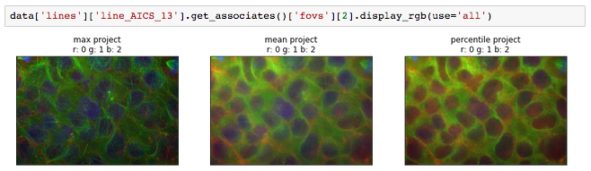

# quiltloader



## About
---

QuiltLoader is a project to add arbitrary attributes and functions to the
defined [quilt](quiltdata.com) nodes.
At it's core, it is primarily defined to support AICS quilt datasets with
navigating and conducting analysis of the data contained in the loaded
dataset. While the default functions and attributes added to the quiltloader
object are aimed to support [AICS
datasets](https://quiltdata.com/package/aics/), this project can work as a
template for implementing your own arbitrary attributes to your own datasets.

## Installation
---

To install this project alone, simply:

`pip install git+https://github.com/AllenCellModeling/QuiltLoader.git`

If you want to test the installation, you can additionally install
[AICS datasets](https://quiltdata.com/package/aics/) and look to the Basic
Usage portion of this README or follow similar steps found in the
[explainer.ipynb](examples/explainer.ipynb).

## Basic Usage
---

To import QuiltLoader:

```Python
from quiltloader import QuiltLoader
```

To import a dataset and add the QuiltLoader defaults:

```Python
data = QuiltLoader('aics/random_sample')
```

Get Item, Iterables, Slices, and Items:

```Python
random_fov = data['fovs'][12]
line_names = [line['info']['line'] for line in data['lines']]
even_plates = [plate for plate in data['plates'][0::2]]
fov_items = data['fovs'].items()
```

To load a TiffFile object:

```Python
img = data['fovs'][18]['image']
```

To change the default loaders:

```Python
import tifffile
loaders = {'image': tifffile.imread}

data = QuiltLoader('aics/random_sample', load_functions=loaders)

# ['image'] requests now return numpy.ndarray
img = data['fovs'][18]['image']
```

Default loaders allow for inline continuation of data filtering:

```Python
# ['info'] requests return an opened json object as a dict
associated_fovs = data['lines']['line_AICS_13']['info']['fovs']
```

## Default Navigation and Analysis Functions
---
