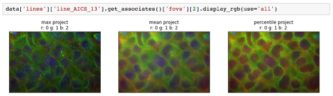
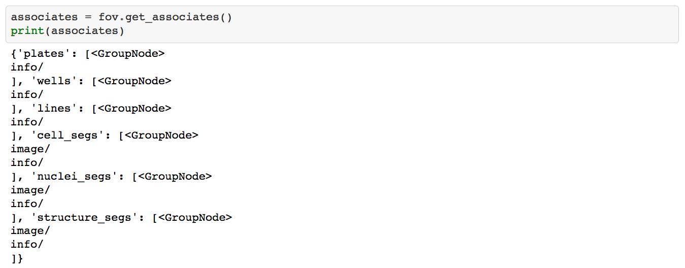
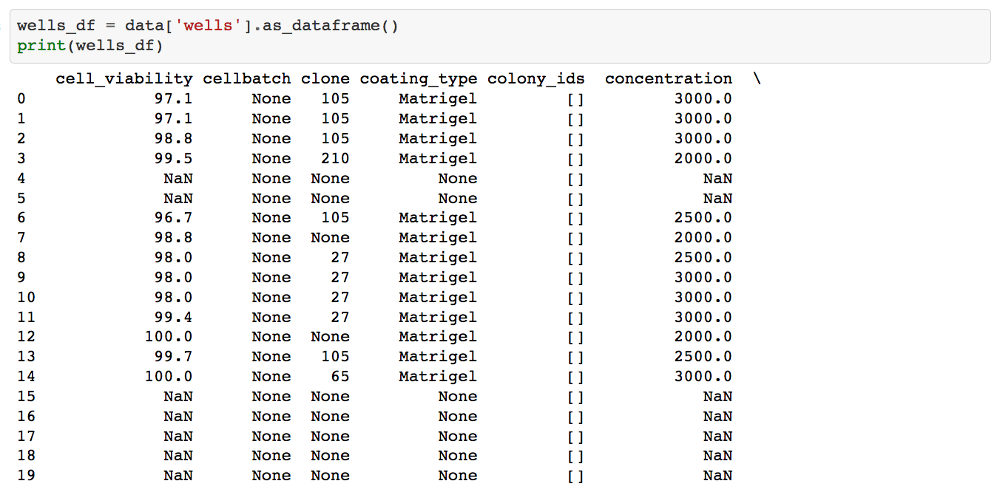
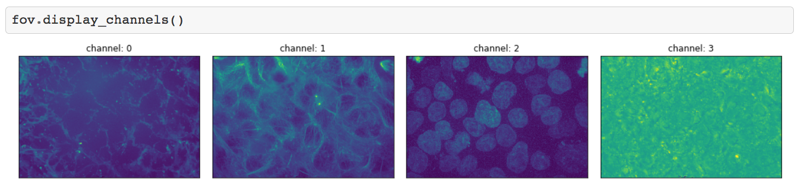
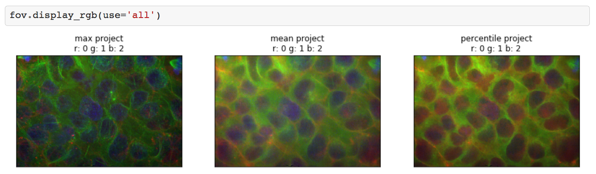
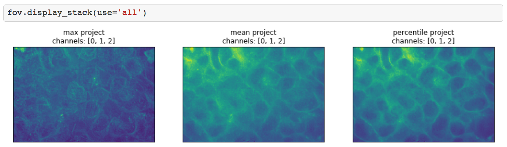

> [!IMPORTANT]
> We are no longer actively maintaining this repository. All active work by the Allen Institute for Cell Science is located under the **[AllenCell](https://github.com/AllenCell)** organization.

# quiltloader



## About

QuiltLoader is a project to add arbitrary attributes and functions to the
defined [quilt](https://quiltdata.com) nodes.
At it's core, it is primarily defined to support AICS quilt datasets with
navigating and conducting analysis of the data contained in the loaded
dataset. While the default functions and attributes added to the quiltloader
object are aimed to support [AICS
datasets](https://quiltdata.com/package/aics/), this project can work as a
template for implementing your own arbitrary attributes to your own datasets.

## Installation

To install this project alone, simply:

`pip install git+https://github.com/AllenCellModeling/QuiltLoader.git`

If you want to test the installation, you can additionally install
[AICS datasets](https://quiltdata.com/package/aics/) and look to the Basic
Usage portion of this README or follow similar steps found in the
[explainer.ipynb](examples/explainer.ipynb).

## Basic Usage

To import QuiltLoader:

```Python
from quiltloader import QuiltLoader
```

To import a dataset and add the QuiltLoader defaults:

```Python
data = QuiltLoader("aics/random_sample")
```

Get Item, Iterables, Slices, and Items:

```Python
random_fov = data["fovs"][12]
line_names = [line["info"]["line"] for line in data["lines"]]
even_plates = [plate for plate in data["plates"][0::2]]
fov_items = data["fovs"].items()
```

To load a TiffFile object:

```Python
img = data["fovs"][18]["image"]
```

To change the default loaders:

```Python
import tifffile
loaders = {"image": tifffile.imread}

data = QuiltLoader("aics/random_sample", load_functions=loaders)

# ["image"] requests now return numpy.ndarray
img = data["fovs"][18]["image"]
```

Default loaders allow for inline continuation of data filtering:

```Python
# ["info"] requests return an opened json object as a dict
associated_fovs = data["lines"]["line_AICS_13"]["info"]["fovs"]
```

## Default Navigation and Analysis Functions

Get the known associated nodes to node the function is called on.

```Python
associates = data["fovs"][18].get_associates()
```



Collect and format all metadata files of a base node into a pandas dataframe.

```Python
all_wells = data["wells"].as_dataframe()
```



Display the best guess at valuable channels of a standard AICS image node.

```Python
fov = data["fovs"][18]
fov.display_channels()

# change which channels are displayed by changing the use_channels parameter
# fov.display_channels(use_channels=[0,3])
```



Display the best guess at valuable channels of a standard AICS image node
stacked and converted to a single rgb image.

```Python
fov = data["fovs"][18]
fov.display_rgb(use="all")

# change which channels are displayed by changing the rgb_indices parameter
# fov.display_rgb(rgb_indices=[0,1,2])

# change which projection is used by changing the use parameter
# use options: "max" (default), "mean", "percentile", "all"

# change what percentile is used by changing the percentile parameter
# percentile default: 75.0

# fov.display_rgb(use="mean")
```



Display the best guess at valuable channels of a standard AICS image node
stacked and given slight transparency.

```Python
fov = data["fovs"][18]
fov.display_stack(use="all")

# change which channels are displayed by changing the use_indices parameter
# fov.display_stack(use_indices=[0,1,2])

# change which projection is used by changing the use parameter
# use options: "max" (default), "mean", "percentile", "all"

# change what percentile is used by changing the percentile parameter
# percentile default: 75.0

# fov.display_stack(use="mean")
```



## Contact

Jackson Maxfield Brown

jacksonb@alleninstitute.org

## License

This program is free software: you can redistribute it and/or modify it
under the terms of the GNU General Public License as published by the Free
Software Foundation, either version 3 of the License, or (at your option)
any later version.

This program is distributed in the hope that it will be useful, but WITHOUT
ANY WARRANTY; without even the implied warranty of MERCHANTABILITY or
FITNESS FOR A PARTICULAR PURPOSE. See the GNU General Public License for
more details.

You should have received a copy of the GNU General Public License along with
this program. If not, see http://www.gnu.org/licenses/.
